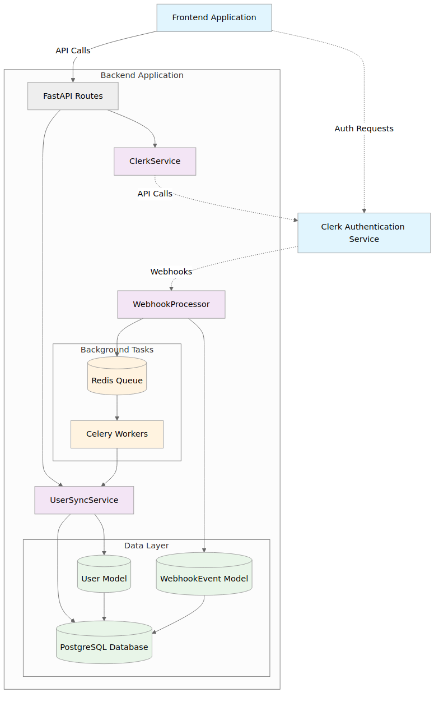
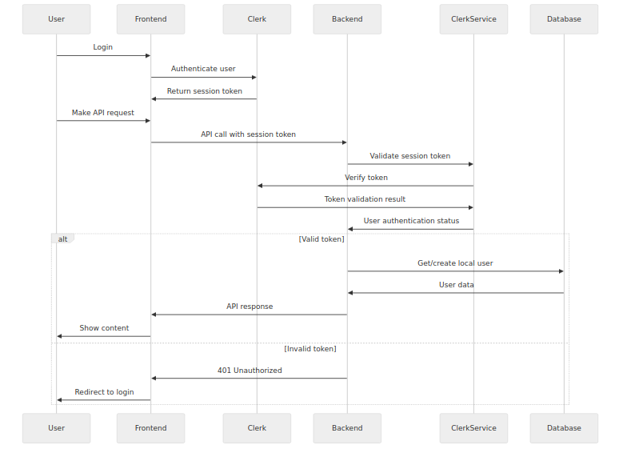
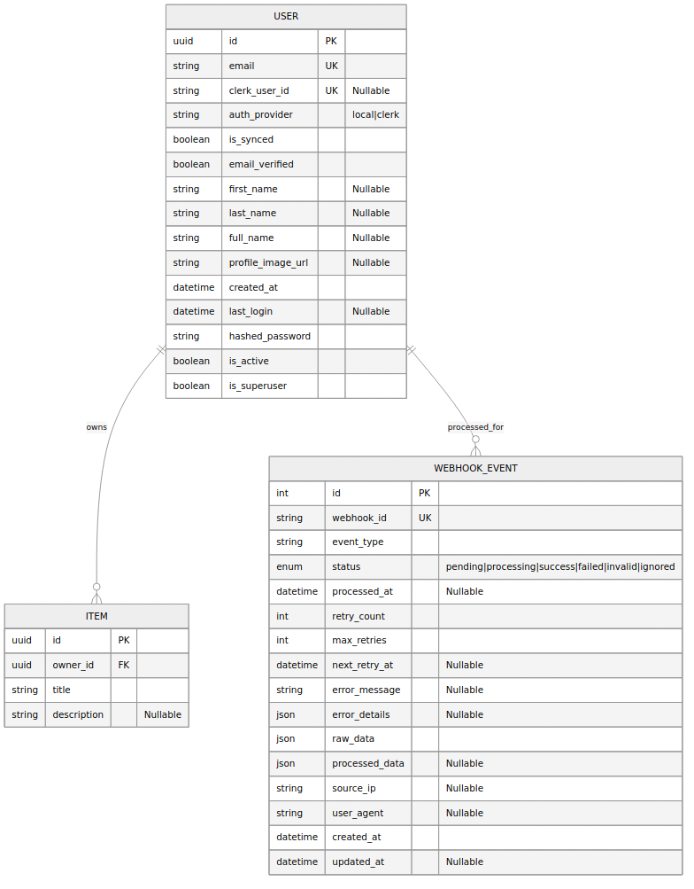
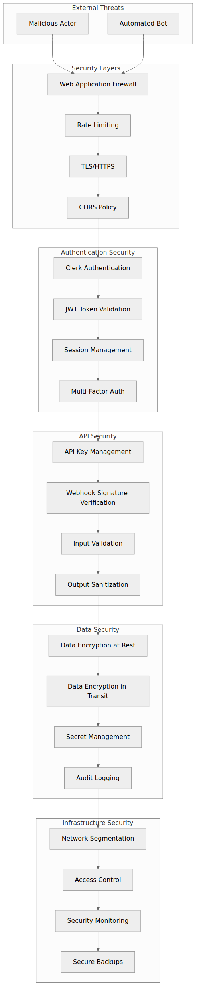
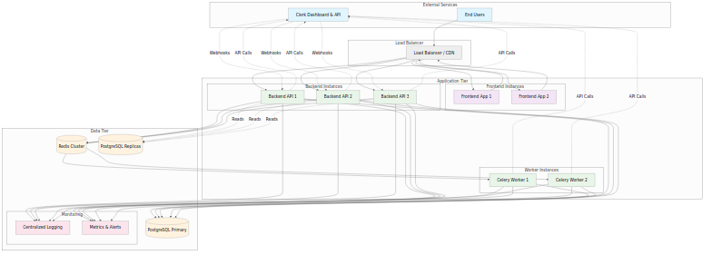

# MatchBot AI - Full Stack Application

A modern full-stack application with Clerk authentication integration, built with FastAPI and React.

## 🏗️ Architecture Overview

MatchBot AI follows a microservices architecture with clear separation between frontend, backend, and external services.



### Core Components

- **Frontend**: React + TypeScript with TanStack Router
- **Backend**: FastAPI with async processing via Celery 
- **Authentication**: Clerk integration with JWT validation
- **Database**: PostgreSQL with SQLModel ORM
- **Caching/Queue**: Redis for task queuing and caching
- **Background Processing**: Celery workers for async tasks

## 🔐 Authentication Flow

The application uses Clerk for authentication with seamless backend synchronization:



1. **Frontend Authentication**: Users authenticate via Clerk
2. **Token Validation**: Backend validates Clerk session tokens
3. **User Synchronization**: Background tasks sync user data
4. **Route Protection**: Frontend middleware protects routes by role

## 💾 Database Schema



### Key Models
- **User**: Local user representation with Clerk integration
- **WebhookEvent**: Tracks Clerk webhook processing 
- **Item**: Core business entity owned by users

## 🔄 Webhook Processing

Real-time user synchronization via Clerk webhooks:


- Signature verification for security
- Asynchronous processing via Celery
- Exponential backoff retry logic
- Comprehensive error handling

## 🚀 Technology Stack

### Backend
- **FastAPI** - Modern Python web framework
- **SQLModel** - Type-safe database ORM
- **Celery** - Distributed task queue
- **Redis** - In-memory data structure store
- **PostgreSQL** - Relational database
- **Clerk SDK** - Authentication service integration

### Frontend  
- **React** - UI library with hooks
- **TypeScript** - Type-safe JavaScript
- **TanStack Router** - File-based routing
- **Chakra UI v3** - Component library
- **Vite** - Build tool and dev server

### Infrastructure
- **Docker** - Containerization
- **Docker Compose** - Multi-container orchestration
- **Traefik** - Reverse proxy and load balancer

## 📁 Project Structure

```
matchbot_ai/
├── backend/                 # FastAPI backend
│   ├── app/
│   │   ├── api/routes/     # API endpoints
│   │   ├── services/       # Business logic layer
│   │   ├── core/          # Configuration and settings
│   │   └── models/        # Database models
│   └── tests/             # Backend tests
├── frontend/              # React frontend  
│   ├── src/
│   │   ├── routes/        # Page components
│   │   ├── components/    # Reusable UI components
│   │   ├── services/      # API clients
│   │   └── config/        # Frontend configuration
│   └── tests/            # Frontend tests
└── docs/                 # Documentation
    └── diagrams/         # Architecture diagrams
```

## 🛡️ Security Architecture  



Multi-layered security approach:
- **Authentication**: Clerk OAuth/JWT tokens
- **Authorization**: Role-based access control (RBAC)  
- **API Security**: Rate limiting and input validation
- **Data Protection**: Encrypted secrets and secure headers
- **Infrastructure**: Network security and monitoring

## 🔧 Development Setup

### Prerequisites
- Docker and Docker Compose
- Node.js 18+ and npm
- Python 3.11+

### Quick Start

1. **Clone the repository**
```bash
git clone <repository-url>
cd matchbot_ai
```

2. **Environment setup**
```bash
cp .env.example .env
# Update Clerk credentials and database settings
```

3. **Start development environment**
```bash
docker-compose up -d
```

4. **Access the application**
- Frontend: http://localhost:5173
- Backend API: http://localhost:8000
- API Documentation: http://localhost:8000/docs

## 📈 Production Deployment



The production setup includes:
- Load balancers for high availability
- Multiple backend instances
- Redis cluster for scaling
- PostgreSQL with replication
- Monitoring and logging infrastructure

## 🧪 Testing

- **Backend**: Pytest with async support
- **Frontend**: Playwright for E2E testing
- **Integration**: Docker-based test environments

## 📚 Documentation

Comprehensive documentation available in the `/docs` directory:

- [Service Layer Architecture](./docs/diagrams/clerk_intergration/service-layer-architecture.png)
- [User Registration Process](./docs/diagrams/clerk_intergration/user-registration-flow.png)
- [Error Handling & Retry Logic](./docs/diagrams/clerk_intergration/error-handling-retry.png)
- [Deployment Guide](./docs/diagrams/clerk_intergration/clerk-deployment-guide.md)

## 🔗 Key Features

- **Role-Based Access Control (RBAC)** - Fine-grained permissions
- **Real-time User Sync** - Automatic Clerk webhook processing  
- **Frontend Route Protection** - Middleware-based auth guards
- **Background Task Processing** - Async operations via Celery
- **API Client Generation** - Automatic OpenAPI client generation
- **Dark Mode Support** - Theme switching capability

## 📄 License

This project is licensed under the MIT License.
