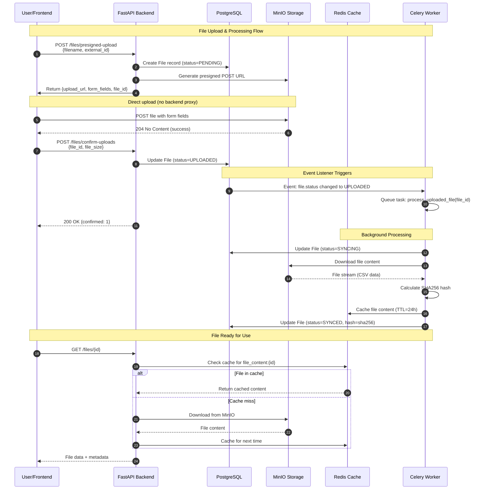

# File Upload Flow - Visual Documentation

## Sequence Diagram

## Flow Description

### Phase 1: Request Upload URL (Steps 1-3)
- Frontend requests presigned URL from backend
- Backend creates database record with PENDING status
- MinIO generates secure POST URL with temporary credentials
- Frontend receives upload URL and form fields

### Phase 2: Direct Upload to MinIO (Step 4)
- Frontend uploads file directly to MinIO (bypassing backend)
- No backend resources used for file transfer
- MinIO validates signature and accepts file

### Phase 3: Confirm Upload (Steps 5-8)
- Frontend notifies backend that upload completed
- Backend updates database status to UPLOADED
- SQLAlchemy event listener detects status change
- Celery task automatically queued for processing

### Phase 4: Background Processing (Steps 9-14)
- Celery worker picks up task from Redis queue
- Worker downloads file from MinIO
- Calculates SHA256 hash for integrity
- Caches file content in Redis (24h TTL)
- Updates database status to SYNCED

### Phase 5: File Access (Steps 15-18)
- Frontend requests file data
- Backend checks Redis cache first (fast path)
- If cache miss, downloads from MinIO and caches
- Returns file content and metadata to frontend

## Key Features

✅ **Security**: Presigned URLs eliminate need for frontend credentials
✅ **Performance**: Direct upload to storage, no backend proxy
✅ **Reliability**: Automatic retry on network failures
✅ **Caching**: Redis cache reduces MinIO load
✅ **Async Processing**: Non-blocking background tasks
✅ **Event-Driven**: SQLAlchemy listeners trigger processing automatically

## Technical Stack

- **FastAPI**: REST API endpoints
- **PostgreSQL**: File metadata and status tracking
- **MinIO**: S3-compatible object storage
- **Redis**: Task queue (Celery broker) + file content cache
- **Celery**: Distributed task processing
- **SQLAlchemy**: ORM with event listeners
