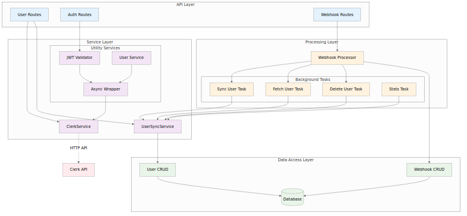
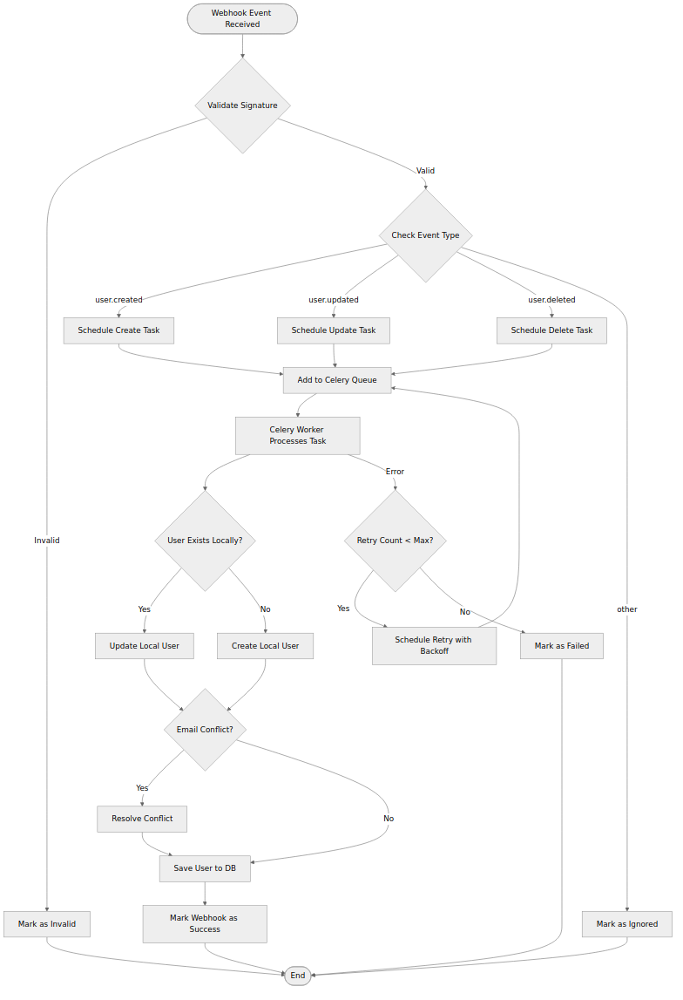
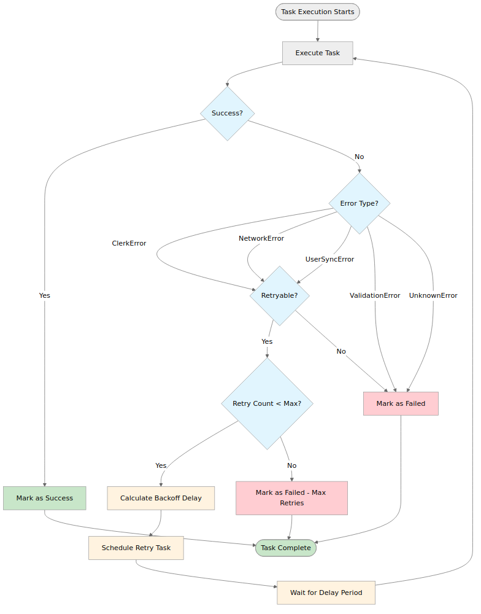

# Clerk Authentication Integration - Visual Diagrams

This directory contains visual diagrams illustrating the Clerk authentication integration architecture and processes. All diagrams are provided in PNG format for easy viewing and documentation.

## 📁 Directory Structure

```
docs/diagrams/
├── clerk-system-overview.png          # Overall system architecture
├── user-registration-flow.png         # User signup process
├── user-authentication-flow.png       # User login process  
├── webhook-state-machine.png          # Webhook processing states
├── user-sync-process.png              # User synchronization workflow
├── database-schema.png                # Database relationships
├── service-layer-architecture.png     # Service layer structure
├── production-architecture.png        # Production deployment
├── error-handling-retry.png          # Error handling logic
├── security-architecture.png         # Security layers
├── *.mmd files                        # Source Mermaid files
├── puppeteer-config.json             # Config for diagram generation
└── README.md                          # This file
```

## 🎯 Available Diagrams

### 1. System Architecture Diagrams

#### Clerk System Overview ([clerk-system-overview.png](./clerk-system-overview.png))

*Overall system architecture showing external services, backend components, background processing, and data layer interactions.*

#### Service Layer Architecture ([service-layer-architecture.png](./service-layer-architecture.png))

*Detailed view of the service layer showing API routes, services, processing layer, and data access components.*

#### Production Architecture ([production-architecture.png](./production-architecture.png))

*Production deployment architecture with load balancers, multiple instances, and monitoring infrastructure.*

### 2. Process Flow Diagrams

#### User Registration Flow ([user-registration-flow.png](./user-registration-flow.png))

*Step-by-step sequence diagram showing the complete user registration process from frontend signup to database synchronization.*

#### User Authentication Flow ([user-authentication-flow.png](./user-authentication-flow.png))

*Authentication process flow showing session token validation and API request handling.*

#### User Synchronization Process ([user-sync-process.png](./user-sync-process.png))

*Detailed flowchart of the webhook processing and user synchronization workflow, including error handling and retry logic.*

### 3. State Management Diagrams

#### Webhook State Machine ([webhook-state-machine.png](./webhook-state-machine.png))

*State machine diagram showing webhook processing states and transitions with retry logic.*

#### Error Handling and Retry Logic ([error-handling-retry.png](./error-handling-retry.png))

*Comprehensive error handling and retry mechanism flowchart for background tasks.*

### 4. Data Architecture Diagrams

#### Database Schema ([database-schema.png](./database-schema.png))

*Entity relationship diagram showing User, WebhookEvent, and Item models with their relationships and key fields.*

### 5. Security Diagrams

#### Security Architecture ([security-architecture.png](./security-architecture.png))

*Multi-layered security architecture showing threat protection, authentication, API security, data protection, and infrastructure security.*

## Diagram Usage

These diagrams are designed to help with:

- **System Understanding**: Get a quick visual overview of the entire Clerk integration
- **Architecture Planning**: Use as reference for scaling and deployment decisions  
- **Process Documentation**: Share with team members to explain workflows
- **Troubleshooting**: Visual aid for debugging integration issues
- **Security Reviews**: Reference security controls and data flow

## 🛠️ Creating/Editing Diagrams

These diagrams were created using **Mermaid** (https://mermaid.js.org/) and converted to PNG format.

### To edit or create new diagrams:

1. **Edit the Mermaid source**:
   - Modify the corresponding `.mmd` file
   - Or create a new `.mmd` file with Mermaid syntax

2. **Convert to PNG**:
   ```bash
   mmdc -i [diagram-name].mmd -o [diagram-name].png -t neutral -b white -p puppeteer-config.json
   ```

3. **Update documentation**:
   - Add the new diagram to this README
   - Reference it in the main documentation

### Available Tools:
- **Online Editor**: https://mermaid.live/
- **CLI Tool**: `@mermaid-js/mermaid-cli` (already installed)
- **VS Code Extension**: Mermaid Preview

## Technical Details

- **Format**: PNG images with white backgrounds
- **Theme**: Neutral theme for professional documentation
- **Resolution**: High resolution suitable for presentations and documentation
- **Source Files**: Corresponding `.mmd` files available for modifications

## 🔗 Related Documentation

- [Clerk Authentication Integration Documentation](../clerk-authentication-integration.md)
- [Deployment Guide](./clerk-deployment-guide.md)
- [System Architecture Guide](./clerk-system-architecture.md)
- [Clerk Integration Implementation](../prps/MAT-14-MR1-clerk-core-config.md)