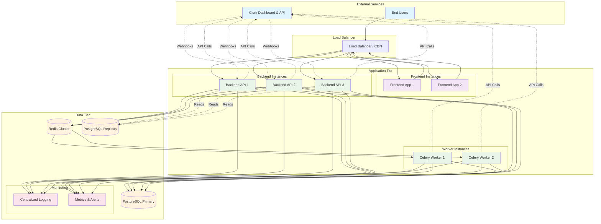
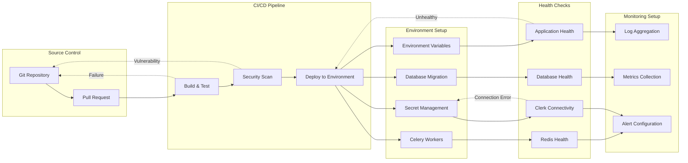
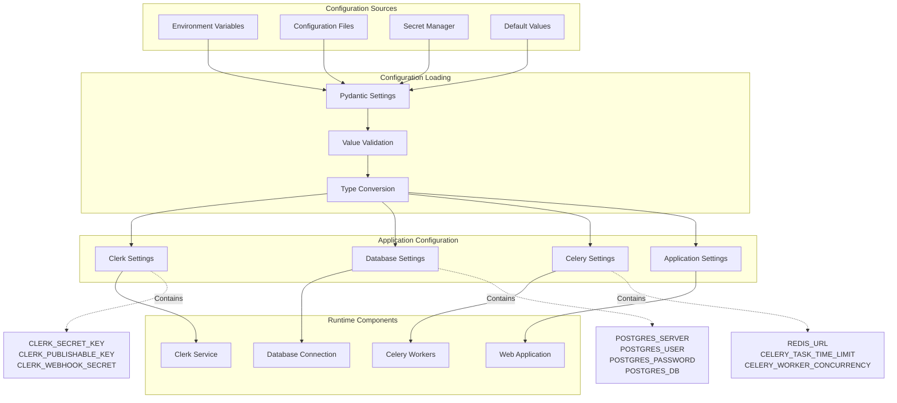
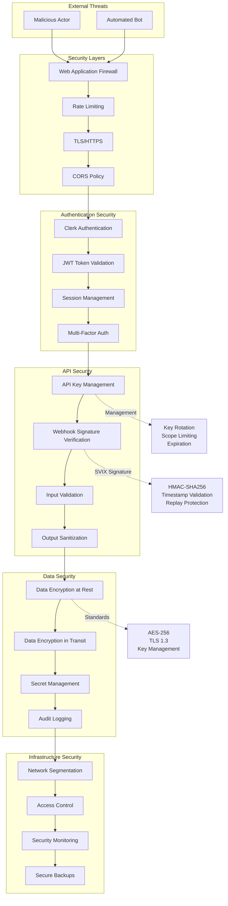
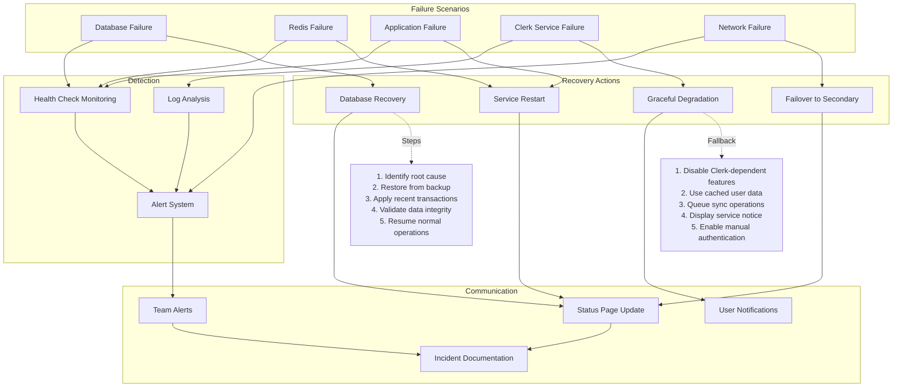

# Clerk Integration Deployment Guide

## Production Architecture

## Environment Configuration Matrix

```mermaid
graph TB
    subgraph "Development Environment"
        DevEnv[Local Development]
        DevConfig[Config Values]
        DevServices[Services]
        
        DevConfig --> DevClerk[Clerk Test Instance]
        DevConfig --> DevDB[(Local PostgreSQL)]
        DevConfig --> DevRedis[(Local Redis)]
        
        DevEnv --> DevConfig
        DevServices --> DevDB
        DevServices --> DevRedis
    end
    
    subgraph "Staging Environment" 
        StageEnv[Staging Deployment]
        StageConfig[Config Values]
        StageServices[Services]
        
        StageConfig --> StageClerk[Clerk Staging Instance]
        StageConfig --> StageDB[(Staging PostgreSQL)]
        StageConfig --> StageRedis[(Staging Redis)]
        
        StageEnv --> StageConfig
        StageServices --> StageDB
        StageServices --> StageRedis
    end
    
    subgraph "Production Environment"
        ProdEnv[Production Deployment]
        ProdConfig[Config Values]
        ProdServices[Services]
        
        ProdConfig --> ProdClerk[Clerk Production Instance]
        ProdConfig --> ProdDB[(Production PostgreSQL)]
        ProdConfig --> ProdRedis[(Production Redis Cluster)]
        
        ProdEnv --> ProdConfig
        ProdServices --> ProdDB
        ProdServices --> ProdRedis
    end
    
    %% Configuration details
    DevConfig -.->|"CLERK_SECRET_KEY=sk_test_xxx<br/>CLERK_WEBHOOK_SECRET=whsec_test_xxx"| DevDetails[Development Config]
    StageConfig -.->|"CLERK_SECRET_KEY=sk_test_xxx<br/>CLERK_WEBHOOK_SECRET=whsec_test_xxx<br/>ENVIRONMENT=staging"| StageDetails[Staging Config]
    ProdConfig -.->|"CLERK_SECRET_KEY=sk_live_xxx<br/>CLERK_WEBHOOK_SECRET=whsec_live_xxx<br/>ENVIRONMENT=production"| ProdDetails[Production Config]
    
    %% Styling
    classDef dev fill:#e8f5e8
    classDef stage fill:#fff3e0
    classDef prod fill:#ffebee
    
    class DevEnv,DevConfig,DevServices,DevClerk,DevDB,DevRedis dev
    class StageEnv,StageConfig,StageServices,StageClerk,StageDB,StageRedis stage
    class ProdEnv,ProdConfig,ProdServices,ProdClerk,ProdDB,ProdRedis prod
```

## Deployment Pipeline

## Configuration Management

## Monitoring and Observability

```mermaid
graph TB
    subgraph "Application Metrics"
        UserMetrics[User Sync Metrics]
        WebhookMetrics[Webhook Processing Metrics]
        APIMetrics[API Performance Metrics]
        TaskMetrics[Background Task Metrics]
    end
    
    subgraph "System Metrics"
        CPUMetrics[CPU Utilization]
        MemoryMetrics[Memory Usage]
        DiskMetrics[Disk I/O]
        NetworkMetrics[Network Traffic]
    end
    
    subgraph "Business Metrics"
        UserGrowth[User Registration Rate]
        AuthSuccess[Authentication Success Rate]
        SyncHealth[Sync Success Rate]
        ErrorRates[Error Rates by Type]
    end
    
    subgraph "Alerting"
        HighErrorRate[High Error Rate Alert]
        SyncFailures[Sync Failure Alert]
        APILatency[High Latency Alert]
        SystemHealth[System Health Alert]
    end
    
    subgraph "Dashboards"
        OperationalDB[Operational Dashboard]
        BusinessDB[Business Dashboard]
        TechnicalDB[Technical Dashboard]
    end
    
    %% Metrics collection
    UserMetrics --> OperationalDB
    WebhookMetrics --> OperationalDB
    APIMetrics --> TechnicalDB
    TaskMetrics --> OperationalDB
    
    UserGrowth --> BusinessDB
    AuthSuccess --> BusinessDB
    SyncHealth --> BusinessDB
    ErrorRates --> TechnicalDB
    
    %% Alerting triggers
    WebhookMetrics --> HighErrorRate
    TaskMetrics --> SyncFailures
    APIMetrics --> APILatency
    CPUMetrics --> SystemHealth
    MemoryMetrics --> SystemHealth
    
    %% Alert destinations
    HighErrorRate --> PagerDuty[PagerDuty]
    SyncFailures --> Slack[Slack Channel]
    APILatency --> Email[Email Notifications]
    SystemHealth --> PagerDuty
```

## Security Architecture

## Disaster Recovery Plan

