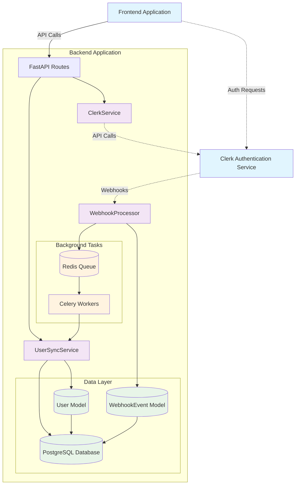
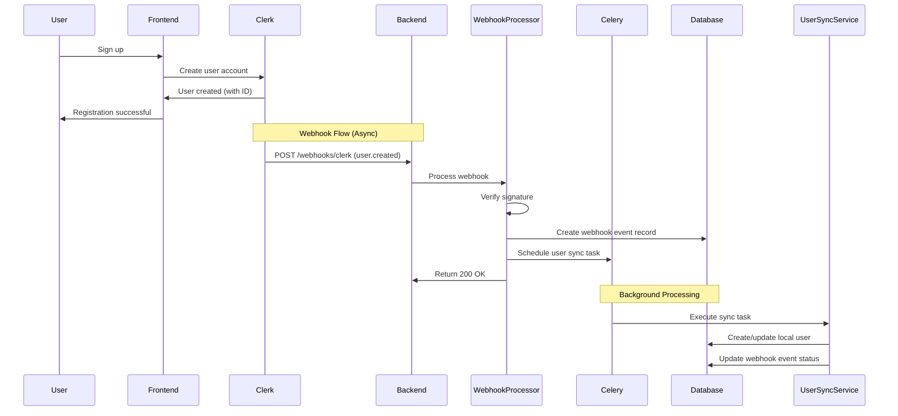
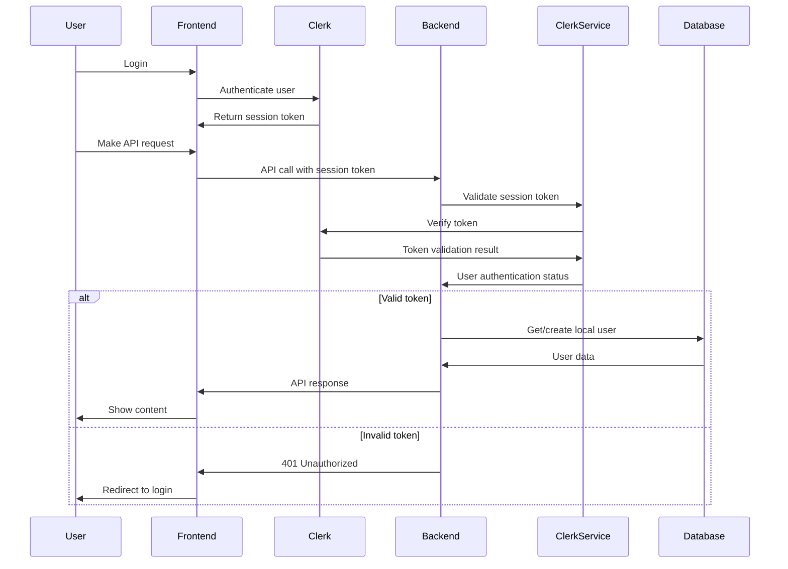
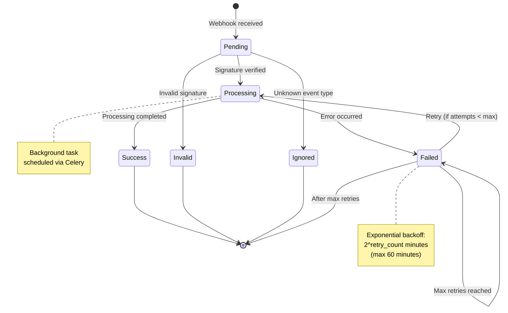
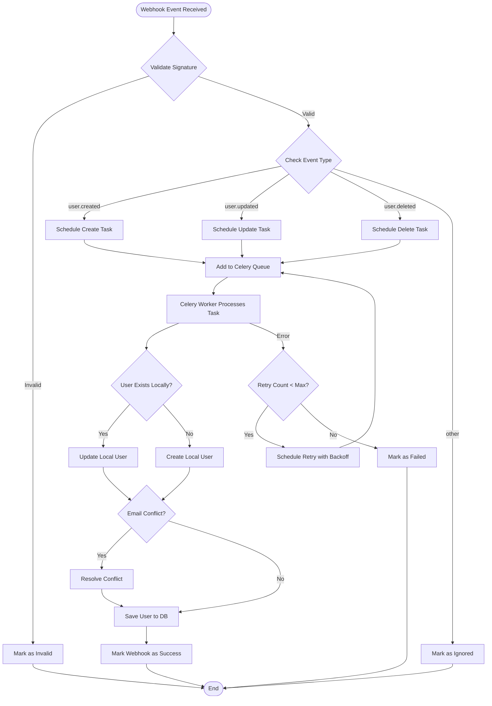
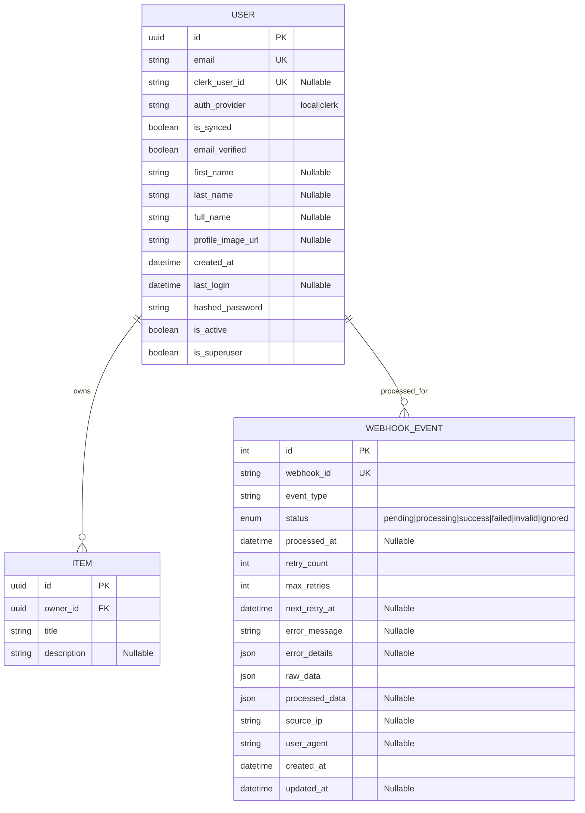
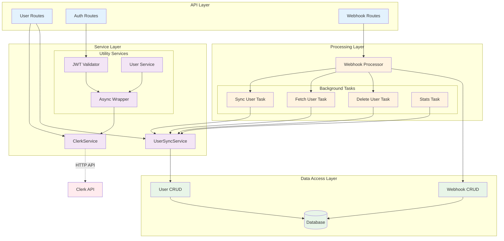
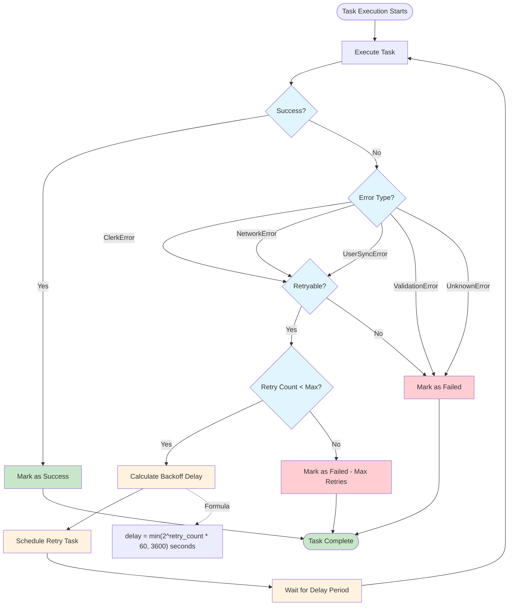

# Clerk Authentication System Architecture Diagrams

## System Overview Diagram

## User Registration Flow

## User Authentication Flow

## Webhook Processing State Machine

## User Synchronization Process

## Database Schema Relationships

## Service Layer Architecture

## Error Handling and Retry Logic

