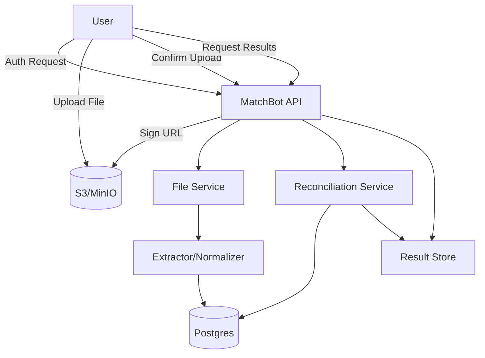

# MatchBot AI — Reconciliation Feature Design Document

## Introduction and Overview

The **Reconciliation Feature** in MatchBot AI enables users to upload financial documents (CSV, XLSX, PDF in later versions), choose a source of truth file, compare other documents against it, and generate reports for mismatched or missing records. This design document focuses on the **MVP implementation** of reconciliation, assuming authentication and authorization are already handled in the broader project.

Key MVP goals:

* Simple but robust file upload flow.
* Direct file uploads to storage (S3 or MinIO).
* Ability to link files to reconciliations explicitly.
* Basic extraction and normalization into a unified schema (`transactions`).
* Reconciliation engine for comparisons.
* Persisted results for reporting.

---

## System Architecture



### Why S3/MinIO?

* **S3**: Managed, scalable, reliable → great for production.
* **MinIO**: Lighter-weight, self-hosted, good for local/dev or cost-sensitive MVPs.

Tradeoff: For MVP, MinIO can simplify setup. For production, S3 wins on reliability.

---

## Data Design

### Main Entities

* **User**: Already exists, owns reconciliations and files.
* **Reconciliation**: High-level grouping, has one source file and multiple comparison files.
* **File**: Metadata about an uploaded document (status, path, reconciliation link, hash, etc.).
* **Transaction**: Normalized rows extracted from each file, used for reconciliation.
* **ReconciliationResult**: Stores mismatches, missing IDs, duplicates.

### Relationships

* A **Reconciliation** has many **Files**.
* A **File** has many **Transactions**.
* A **Reconciliation** has one or many **ReconciliationResults** (optional if stored separately).

### Hashes

* **row\_hash**: Hash of a single row for deduplication.
* **full\_hash**: Hash of the entire file (all rows) to detect re-uploads or tampering.

---

## Interface Design

### API Endpoints (MVP)

**Reconciliation Lifecycle**

* `POST /reconciliations` → Create reconciliation. Returns `reconciliation_id`.
* `GET /reconciliations/:id` → Get reconciliation details and status.
* `GET /reconciliations/:id/results` → Get reconciliation results.

**File Handling**

* `POST /files/sign_upload` → Request signed URL for upload.

  ```json
  { "reconciliation_id": "uuid", "type": "source|comparison", "filename": "file.csv" }
  ```
* `POST /files/confirm` → Confirm file upload and link it to reconciliation.

  ```json
  { "file_id": "uuid", "reconciliation_id": "uuid", "metadata": { "columns": [...], "row_count": 123 } }
  ```
* `GET /files/:id/status` → Fetch file status (UPLOADING, READY, FAILED).

**Reconciliation Execution**

* `POST /reconciliations/:id/run` → Start reconciliation job.
* `GET /reconciliations/:id/status` → Check progress.

---

## Component Design

### File Service

* Generates signed URLs for uploads.
* Manages file lifecycle (PENDING → UPLOADED → READY → FAILED).
* Validates and confirms file uploads via `/files/confirm`.
* Stores metadata (hashes, reconciliation link).

### Extractor/Normalizer

* Parses CSV/XLSX into rows.
* Maps fields into a normalized **transactions** table.
* Handles schema drift by storing `extra_metadata` JSON for unmapped fields.

### Reconciliation Service

* Compares transactions from source vs. comparison files.
* Detects missing, mismatched, duplicate records.
* Generates a result object and stores it.

---

## User Interface Design (Future)

* Simple dashboard listing reconciliations.
* File upload forms (source + comparison).
* Report view showing flagged discrepancies.

For MVP, API-only interface is sufficient.

---

## Assumptions and Dependencies

* Auth & authorization already in place.
* Storage: S3 (preferred) or MinIO (MVP/local).
* DB: Postgres for relational integrity.
* CSV/XLSX parsing libraries available.
* Background workers (Sidekiq, Celery, RQ, etc.) will be needed for heavy extraction & reconciliation.

---

## Tradeoffs and Why

* **/files/confirm vs. S3 webhook**: We keep `/files/confirm` for MVP simplicity and explicit file-to-reconciliation linking. Webhook-only adds infra complexity too early.
* **Normalization into `transactions`**: Keeps reconciliation logic simple, but forces design of a flexible schema (finite columns + extra JSON metadata). Tradeoff between simplicity and future-proofing.
* **Result storage**: We separate reconciliation results for flexibility. Could embed in reconciliation table, but large results may bloat that entity.
* **Storage choice**: MinIO for MVP → faster to iterate. S3 for production scale.

---

## Example Flow (Upload + Run Reconciliation)

1. User creates reconciliation via `POST /reconciliations`.
2. User requests signed URL for source file → uploads → confirms via `/files/confirm`.
3. User requests signed URLs for comparison files → uploads → confirms.
4. File Service marks files `READY` and triggers Extractor → transactions stored.
5. User runs reconciliation via `POST /reconciliations/:id/run`.
6. Reconciliation Service compares source vs. comparison transactions.
7. Results stored in `reconciliation_results` table.
8. User fetches results via `GET /reconciliations/:id/results`.

---


Tasks

---

### **Upload Flow Tasks**

#### **Remote Storage Setup**

* [ ] Choose storage (AWS S3 for production, MinIO for dev to reduce cost/lock-in).
* [ ] Create bucket(s) with lifecycle policies (e.g., auto-delete after 30 days for unconfirmed files).
* [ ] Configure IAM or access policies for secure presigned upload/download.

#### **Presigned URL**

* [ ] Add backend endpoint `/files/presign` → returns presigned URL for upload.
* [ ] Ensure metadata (filename, size, content-type, user\_id, temporary UUID) is passed along.
* [ ] Restrict allowed types (`.csv`, `.xlsx`, `.pdf` for later).

#### **Webhook / File Callback**

* [ ] Enable S3/MinIO event notification (object created → call webhook).
* [ ] Backend `/files/confirm` endpoint → triggered either:

  * (a) automatically by webhook, or
  * (b) explicitly by client (after successful upload).
* [ ] On confirm, persist file metadata (file\_id, user\_id, size, storage\_url, hash placeholder, status=uploaded).

#### **File Ingestion Table**

* [ ] Create `file_uploads` table with:

  * `id (uuid)`
  * `user_id`
  * `reconciliation_id (nullable until linked)`
  * `filename`
  * `storage_url`
  * `status` (uploaded, confirmed, processing, parsed)
  * `row_count`
  * `hash` (overall file hash)
  * `created_at / updated_at`

#### **Streaming & Extraction**

* [ ] Implement background job (Celery/Sidekiq equivalent) to fetch file from remote storage.
* [ ] Stream file in chunks (avoid loading 1GB+ into memory).
* [ ] Extract data row-by-row.
* [ ] Normalize → map to transactions schema (`id/hash, amount, date, description, extra_metadata`).
* [ ] Store file-level hash + row hashes.

#### **Hashing**

* [ ] Compute:

  * `file_hash` → SHA256 of full file contents.
  * `row_hash` → SHA256 of normalized row values.
* [ ] Store in `transactions` table linked to `file_id`.
* [ ] Deduplication check (if `row_hash` already exists for same user, flag duplicate).

---


