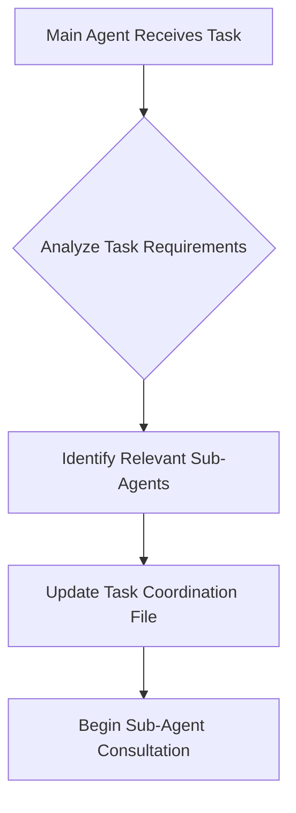
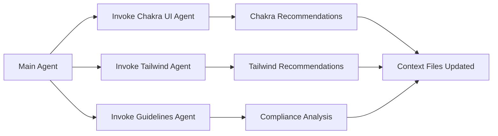
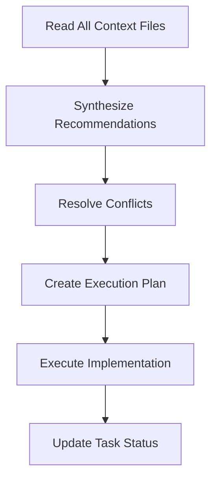

# Frontend Sub-Agent Coordination System

## Overview
The Frontend Sub-Agent Coordination System is a sophisticated advisory framework designed to provide specialized expertise for frontend development tasks. The system consists of three specialized sub-agents that provide recommendations through structured context files, with the main agent responsible for execution and coordination.

## System Architecture

### Core Principles
- **Advisory Only**: Sub-agents provide recommendations but never execute code
- **Context Communication**: All communication through structured markdown files
- **Specialized Expertise**: Each agent focuses on specific domain knowledge
- **Main Agent Execution**: Only the main agent executes code and makes changes

### Sub-Agent Ecosystem
```
Main Agent (Coordinator & Executor)
├── Chakra UI Sub-Agent (Component & Design System Expert)
├── Tailwind Sub-Agent (Utility-first CSS Expert)  
└── Guidelines Compliance Agent (Code Quality & Standards Enforcer)
```

## Sub-Agent Specifications

### 1. Chakra UI Sub-Agent
- **Domain**: Chakra UI components, design tokens, accessibility
- **MCP Integration**: `@chakra-ui/react-mcp`
- **Context File**: `frontend/docs/context/chakra-ui-recommendations.md`
- **Expertise**: Component selection, props guidance, theme management, v2→v3 migrations

### 2. Tailwind Sub-Agent  
- **Domain**: Utility-first CSS, responsive design, performance optimization
- **MCP Integration**: `tailwind-designer-mcp`
- **Context File**: `frontend/docs/context/tailwind-recommendations.md`
- **Expertise**: Utility classes, responsive patterns, CSS optimization, design systems

### 3. Guidelines Compliance Agent
- **Domain**: Frontend code quality, architectural patterns, standards enforcement
- **Context File**: `frontend/docs/context/guidelines-compliance.md`
- **Expertise**: TypeScript standards, React patterns, code quality, UI/UX compliance

## Coordination Workflow

### Phase 1: Task Analysis


### Phase 2: Sub-Agent Consultation


### Phase 3: Synthesis & Execution


## Task Coordination Protocol

### 1. Initialize Task Coordination
```markdown
# Update: frontend/docs/context/task-coordination.md
## Current Task
[Detailed task description]

## Sub-Agents Consulted
- [ ] Chakra UI Sub-Agent
- [ ] Tailwind Sub-Agent  
- [ ] Guidelines Compliance Agent

## Execution Plan
[To be populated after sub-agent consultation]
```

### 2. Sub-Agent Invocation Pattern
```typescript
// Pseudo-code for sub-agent invocation
async function consultSubAgents(task: FrontendTask): Promise<void> {
  // Determine relevant agents
  const relevantAgents = analyzeTaskRequirements(task);
  
  // Invoke sub-agents in parallel
  const consultations = await Promise.all([
    relevantAgents.includes('chakra') ? invokeChakraAgent(task) : null,
    relevantAgents.includes('tailwind') ? invokeTailwindAgent(task) : null,
    invokeGuidelinesAgent(task) // Always consult guidelines agent
  ]);
  
  // Wait for context files to be updated
  await waitForContextFileUpdates();
}
```

### 3. Context File Reading & Synthesis
```typescript
async function synthesizeRecommendations(): Promise<ExecutionPlan> {
  const contexts = await readContextFiles([
    'chakra-ui-recommendations.md',
    'tailwind-recommendations.md', 
    'guidelines-compliance.md'
  ]);
  
  return createExecutionPlan(contexts);
}
```

## Sub-Agent Communication Standards

### Context File Structure
All context files follow standardized sections:

```markdown
# [Agent Type] Recommendations

*Generated by [Agent Name]*

## Task Analysis
[Agent's understanding of the task]

## [Domain-Specific Recommendations]
[Detailed recommendations for the agent's domain]

## Implementation Guidance  
[Specific implementation details]

## Code Examples
[Relevant code examples]

## [Domain-Specific Considerations]
[Additional domain-specific notes]

---
*Last updated: [ISO timestamp]*
*Status: [pending/in-progress/completed]*
```

### Recommendation Priority Levels
- **CRITICAL**: Must be implemented for compliance/functionality
- **HIGH**: Strongly recommended for best practices
- **MEDIUM**: Good to have for optimization
- **LOW**: Nice to have for enhancement

## Conflict Resolution Protocol

### Common Conflict Scenarios

#### 1. Chakra UI vs Tailwind
**Scenario**: Task could use either Chakra components or Tailwind utilities
**Resolution Strategy**:
- Guidelines Agent acts as arbiter
- Follow "Chakra UI first" principle from frontend/CLAUDE.md
- Use Tailwind only when Chakra UI insufficient
- Document decision rationale

#### 2. Performance vs Best Practices
**Scenario**: Performance optimizations conflict with code quality standards
**Resolution Strategy**:
- Prioritize compliance with frontend/CLAUDE.md guidelines
- Find alternative solutions that meet both requirements
- Document trade-offs and rationale

#### 3. Design System vs Custom Requirements
**Scenario**: Custom design requirements vs established patterns
**Resolution Strategy**:
- Attempt to solve within existing design system first
- Justify any deviations with clear documentation
- Ensure accessibility and responsive requirements still met

### Resolution Decision Matrix
```
Guidelines Compliance Score > 85: Follow guidelines recommendation
Chakra UI Available: Use Chakra UI over Tailwind
Performance Critical: Document trade-offs, prefer maintainable solution
Custom Design Required: Minimal viable deviation from standards
```

## Quality Assurance Integration

### Pre-Implementation Checklist
- [ ] All relevant sub-agents consulted
- [ ] Context files contain actionable recommendations
- [ ] Conflicts identified and resolved
- [ ] Execution plan aligns with frontend/CLAUDE.md guidelines
- [ ] Performance implications considered
- [ ] Accessibility requirements addressed

### Post-Implementation Validation
- [ ] Guidelines Compliance Agent reviews final implementation
- [ ] Code quality score meets minimum threshold (85/100)
- [ ] UI/UX standards maintained
- [ ] Responsive design verified
- [ ] Test coverage adequate

## Performance Monitoring

### Sub-Agent Response Times
- Target: Context file updates within 30 seconds
- Monitor: File modification timestamps
- Alert: If any agent takes > 60 seconds to respond

### System Efficiency Metrics
- **Task Completion Rate**: % of tasks successfully coordinated
- **Conflict Resolution Time**: Average time to resolve agent conflicts  
- **Implementation Quality**: Compliance scores over time
- **Agent Utilization**: Frequency of each agent consultation

## Error Handling & Fallbacks

### Sub-Agent Unavailable
```typescript
async function handleAgentFailure(agentType: string): Promise<void> {
  console.warn(`${agentType} agent unavailable, using fallback`);
  
  switch(agentType) {
    case 'chakra-ui':
      // Fallback to basic component recommendations
      await generateBasicChakraGuidance();
      break;
    case 'tailwind':
      // Fallback to standard utility patterns
      await generateBasicTailwindGuidance();
      break;
    case 'guidelines':
      // Always required - escalate to manual review
      throw new Error('Guidelines agent required for compliance');
  }
}
```

### Context File Corruption
- Maintain backup templates
- Automatic regeneration if files corrupted
- Version control integration for recovery

## System Evolution & Maintenance

### Adding New Sub-Agents
1. Create agent documentation in `frontend/docs/sub-agents/[agent-name]/`
2. Add context file template in `frontend/docs/context/`
3. Update coordination system documentation
4. Add agent to task analysis workflow

### Updating Existing Agents
1. Version control all changes
2. Update capabilities documentation
3. Test with sample tasks
4. Monitor performance metrics

### Deprecating Agents
1. Document deprecation rationale
2. Migrate functionality to other agents
3. Archive agent documentation
4. Update coordination workflows

## Usage Examples

### Example 1: New Component Development
```markdown
Task: "Create a responsive user profile card component"

Sub-Agent Consultation:
- Chakra UI Agent: Recommends Card, Avatar, Text, and Stack components
- Tailwind Agent: Provides responsive breakpoint strategy  
- Guidelines Agent: Ensures TypeScript typing and 50-line function limit

Synthesis: Use Chakra UI Card with proper responsive props, implement with TypeScript interfaces, break into smaller functions for avatar, info, and actions sections.
```

### Example 2: Form Implementation
```markdown
Task: "Build a multi-step registration form"

Sub-Agent Consultation:
- Chakra UI Agent: FormControl, Input, Button, Stepper components
- Tailwind Agent: Mobile-first responsive strategy for form layout
- Guidelines Agent: State management pattern (MVC), validation logic separation

Synthesis: Chakra UI form components with proper validation, responsive stepper navigation, state managed through controller pattern with proper TypeScript interfaces.
```

## Success Metrics

### System Effectiveness
- **Code Quality Improvement**: Compliance scores trending upward
- **Development Velocity**: Faster implementation with fewer revisions
- **Consistency**: Standardized patterns across all frontend features
- **Knowledge Transfer**: Team learning through documented recommendations

### Agent Performance
- **Accuracy**: Recommendations align with task requirements
- **Completeness**: All necessary aspects covered in recommendations
- **Actionability**: Recommendations can be directly implemented
- **Quality**: Implementation results meet all standards

This coordination system ensures that every frontend development task benefits from specialized expertise while maintaining consistency, quality, and adherence to established standards.